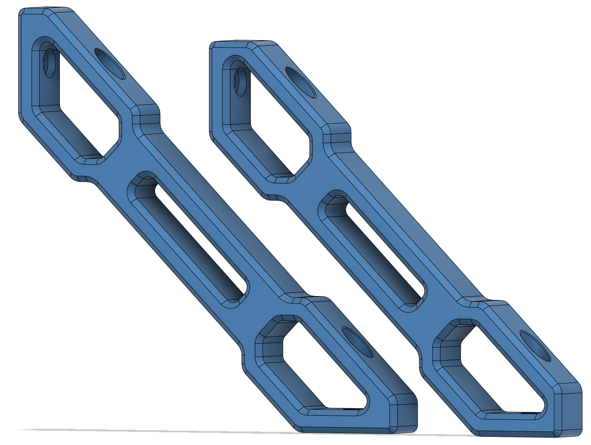
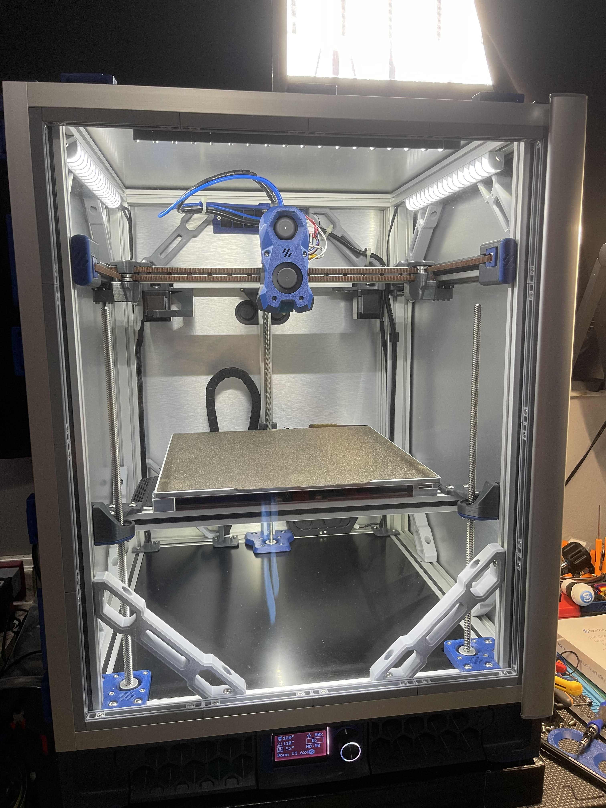

# Trident_Frame_Brace
VZBot style frame brace for Voron Trident

Originally meant for my Tallboy Doom Frame Trident to help with Input Shaper tuning. These braces can be used on any 2020 framed 3D printer, but regular frame Tridents will have limited mounting options. 

# STLs Description

- Trident Frame Brace Large
	- Same size as original VZBot brace.
- Trident Frame Brace Small
	- Size to match up with gantry mounting points.
- Doom Trident Brace
	- Large brace with 0.5mm of extra clearance on one side for Trident Z carriages when mounted to a 2040/4040 Doom Frame with original style panels. 
	
# BOM

- M5x10 screws x2
- M5 roll-in or hammerhead nut x2

# Installed Photo

# Credits

Adapted from the <a href="https://github.com/VzBoT3D/VzBoT-Vz330/tree/master/Assemblies%20BOM%20and%20STL/Frame"> VZBot frame brace. </a> 

## Contact

Contact me via Discord, outrider305#4587 with any questions.
